# LOGIX-3D Entity Relationship Diagram (ERD)

Tài liệu này đặc tả chi tiết 13 thực thể dữ liệu trong hệ thống **LOGIX-3D**. Trong Phase 0, chỉ có 2 bảng cốt lõi là `Company` và `User` được đưa vào migration ban đầu (`0_init`). Các bảng còn lại sẽ được bổ sung theo từng phase nghiệp vụ tương ứng.

---

## 1. Sơ Đồ Quan Hệ Thực Thể (Mermaid ERD)

```mermaid
erDiagram
    Company ||--o{ User : "có nhiều"
    Company ||--o{ Shipment : "tạo (Shipper)"
    Company ||--o{ Quote : "gửi báo giá (FWD)"
    Company ||--o{ Booking : "chỉ định (FWD / CFS)"
    Company ||--o{ Review : "được đánh giá / đánh giá"
    
    Lane ||--o{ Shipment : "thuộc tuyến"
    Lane ||--o{ MatchGroup : "gom theo tuyến"

    Shipment ||--o{ Package : "chứa các kiện"
    Shipment ||--o{ MatchGroupShipment : "tham gia nhóm"
    Shipment ||--o{ ShipmentEvent : "lịch sử sự kiện"

    MatchGroup ||--o{ MatchGroupShipment : "kết nối lô hàng"
    MatchGroup ||--o{ Quote : "nhận báo giá"
    MatchGroup ||--o{ PackingPlan : "tính toán sắp xếp"
    MatchGroup ||--o{ Booking : "chốt hợp đồng"

    ContainerType ||--o{ PackingPlan : "loại cont đóng hàng"

    Quote ||--o{ Booking : "được chọn tạo booking"
    
    PackingPlan ||--o{ LoadingProof : "chứng minh nghiệm thu"
    Booking ||--o{ LoadingProof : "nghiệm thu thực tế"

    Company {
        string id PK
        string taxCode UK "Mã số thuế"
        string name "Tên pháp nhân"
        enum type "SHIPPER | FWD | CFS"
        enum status "PENDING | VERIFIED | REJECTED | SUSPENDED"
        string address "Địa chỉ trụ sở"
        string phone "Số điện thoại đại diện"
        string email "Email liên hệ"
        string website "Website doanh nghiệp"
        string representativeName "Họ tên người đại diện"
        json metadata "Thông tin bổ sung theo vai trò"
        datetime verifiedAt
        datetime createdAt
        datetime updatedAt
        datetime deletedAt
    }

    User {
        string id PK
        string companyId FK
        string email UK
        string passwordHash "Argon2id"
        enum role "ADMIN | SHIPPER_ADMIN | SHIPPER_MEMBER | FWD_ADMIN | FWD_OPERATOR | CFS_ADMIN | CFS_OPERATOR"
        enum status "ACTIVE | INACTIVE | BLOCKED"
        string fullName
        string phone
        string avatarUrl
        datetime lastLoginAt
        datetime createdAt
        datetime updatedAt
        datetime deletedAt
    }

    Lane {
        string id PK
        string code UK "Mã tuyến (VD: HPH-SIN)"
        string originPort "Cảng / Điểm xuất phát"
        string destinationPort "Cảng / Điểm đến"
        enum type "DOMESTIC | INTERNATIONAL"
        boolean active "Trạng thái khai thác"
        int defaultTransitDays
        datetime createdAt
        datetime updatedAt
    }

    Shipment {
        string id PK
        string code UK "Mã lô: LHyyMMddxxx"
        string companyId FK "Chủ hàng"
        string laneId FK "Tuyến vận chuyển"
        int totalCbmMm3 "Tổng thể tích tính bằng mm3 (hoặc cm3)"
        int totalWeightGram "Tổng khối lượng tính bằng gram"
        int estimatedValueVnd "Giá trị hàng (VNĐ)"
        enum status "DRAFT | SUBMITTED | MATCHING | GROUPED | IN_TRANSIT | DELIVERED | CANCELLED"
        datetime readyDate "Ngày hàng sẵn sàng giao"
        datetime deliveryDeadline "Hạn chót giao hàng mong muốn"
        string notes "Yêu cầu bảo quản đặc biệt"
        datetime createdAt
        datetime updatedAt
        datetime deletedAt
    }

    Package {
        string id PK
        string shipmentId FK
        string sku "Mã kiện hàng"
        string name "Tên hàng hóa"
        int lengthMm "Chiều dài (mm)"
        int widthMm "Chiều rộng (mm)"
        int heightMm "Chiều cao (mm)"
        int weightGram "Khối lượng (gram)"
        int quantity "Số lượng kiện giống nhau"
        boolean fragile "Hàng dễ vỡ"
        boolean noStack "Không xếp chồng"
        int maxStackWeightGram "Tải trọng chịu lực đè tối đa (gram)"
        boolean rotatable "Cho phép xoay 6 hướng"
        enum storageType "DRY | COLD | HAZARDOUS | SPECIAL"
        datetime createdAt
        datetime updatedAt
    }

    MatchGroup {
        string id PK
        string code UK "Mã nhóm gom: MGyyMMddxxx"
        string laneId FK
        datetime cutoffTime "Thời hạn chốt ghép hàng"
        enum status "DRAFT | PROPOSED | CONFIRMED | CLOSED | CANCELLED"
        string targetContainerTypeId FK
        datetime createdAt
        datetime updatedAt
    }

    MatchGroupShipment {
        string id PK
        string matchGroupId FK
        string shipmentId FK
        datetime joinedAt
    }

    ContainerType {
        string id PK
        string code UK "20DC | 40DC | 40HC | TRUCK_5T..."
        string name "Tên loại container"
        int innerLengthMm "Chiều dài lòng (mm)"
        int innerWidthMm "Chiều rộng lòng (mm)"
        int innerHeightMm "Chiều cao lòng (mm)"
        int maxPayloadGram "Tải trọng hàng tối đa (gram)"
        int tareWeightGram "Khối lượng vỏ cont (gram)"
        boolean active
    }

    PackingPlan {
        string id PK
        string matchGroupId FK
        string containerTypeId FK
        int fillRateBps "Tỷ lệ lấp đầy (basis points: 8500 = 85.00%)"
        json centerOfGravity "Tọa độ trọng tâm {x, y, z} mm"
        json placedPackages "Danh sách {packageId, x, y, z, rotation, layerIndex}"
        json unplacedPackages "Danh sách kiện không xếp được kèm lý do"
        string algorithmVersion "v1.0.0-heuristic-ep"
        int executionTimeMs "Thời gian chạy thuật toán (ms)"
        datetime createdAt
    }

    Quote {
        string id PK
        string matchGroupId FK
        string fwdCompanyId FK "Công ty FWD"
        int mainFreightVnd "Cước chính (VNĐ)"
        int bunkerFuelVnd "Phụ phí xăng dầu (VNĐ)"
        int documentationVnd "Phí chứng từ (VNĐ)"
        int terminalHandlingVnd "Phí THC / CFS (VNĐ)"
        int vatAmountVnd "Thuế VAT (VNĐ)"
        int totalAmountVnd "Tổng tiền (VNĐ)"
        int transitDays "Thời gian vận chuyển (ngày)"
        datetime validUntil "Thời hạn hiệu lực báo giá"
        enum status "SUBMITTED | ACCEPTED | REJECTED | EXPIRED"
        datetime createdAt
    }

    Booking {
        string id PK
        string code UK "Mã BK: BKyyMMddxxx"
        string quoteId FK
        string matchGroupId FK
        string fwdCompanyId FK
        string cfsCompanyId FK
        string containerCode "Mã hiệu container (VD: TCLU1234567)"
        string sealNumber "Số chì niêm phong (VD: S12345678)"
        enum status "CONFIRMED | AT_CFS | LOADED | SEALED | IN_TRANSIT | ARRIVED | COMPLETED | CANCELLED"
        datetime confirmedAt
        datetime completedAt
        datetime createdAt
        datetime updatedAt
    }

    LoadingProof {
        string id PK
        string bookingId FK
        string packingPlanId FK
        int layerIndex "Số thứ tự lớp hàng (hoặc 0 nếu là ảnh seal/inbound)"
        enum proofType "INBOUND_INSPECTION | LAYER_PACKED | SEAL_CLOSED"
        string imageUrl "Đường dẫn ảnh lưu trên MinIO"
        string uploaderUserId FK
        string notes "Ghi chú kiểm tra của thủ kho CFS"
        datetime createdAt
    }

    ShipmentEvent {
        string id PK
        string shipmentId FK
        string actorUserId FK
        string eventType "SUBMITTED | MATCHED | RECEIVED_CFS | LAYER_PACKED | SEALED | DEPARTED | ARRIVED | DELIVERED"
        string location "Địa điểm phát sinh sự kiện"
        float latitude
        float longitude
        json payload "Dữ liệu đính kèm sự kiện"
        datetime createdAt
    }

    Review {
        string id PK
        string bookingId FK
        string reviewerCompanyId FK
        string targetCompanyId FK
        int ratingScore "1 đến 5 sao"
        json criteriaScores "Chi tiết điểm từng tiêu chí {consulting, speed, safety, attitude}"
        string comment "Nội dung nhận xét"
        datetime createdAt
    }

    PricingConfig {
        string id PK
        string laneId FK
        int ratePerCbmVnd "Đơn giá trên 1 m3 (VNĐ)"
        int ratePerKgVnd "Đơn giá trên 1 kg (VNĐ)"
        int baseFixedFeeVnd "Phụ phí cố định đơn hàng (VNĐ)"
        int fragileFactorBps "Hệ số phụ phí hàng dễ vỡ (11500 = 1.15)"
        int noStackFactorBps "Hệ số phụ phí không xếp chồng (13000 = 1.30)"
        datetime effectiveDate "Ngày áp dụng"
        boolean active
        datetime createdAt
        datetime updatedAt
    }
```

---

## 2. Chiến Lược Đánh Chỉ Mục (Index Strategy)

Tuân thủ nghiêm ngặt yêu cầu kiến trúc của hệ thống:
1. **Multi-tenant Filtering:** Mọi bảng chứa dữ liệu nghiệp vụ theo công ty (`Shipment`, `Quote`, `Booking`, `Review`, `User`) đều có composite index `(companyId, status, createdAt DESC)`.
2. **Phân trang bằng Cursor:** Tất cả API danh sách sử dụng kết hợp `(createdAt, id)` làm cursor phân trang, hoàn toàn loại bỏ `OFFSET` để duy trì tốc độ $O(1)$ khi dữ liệu phình to.
3. **Tra cứu Matching tốc độ cao:** Bảng `Shipment` đánh composite index `(laneId, status, readyDate)` phục vụ truy vấn gom chuyến LCL.
